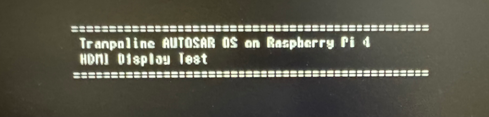

# Trampoline AUTOSAR OS on Raspberry Pi 4

[English](README.md) | [日本語](README.ja.md)

[](https://opensource.org/licenses/MIT)
[](https://www.raspberrypi.org/)
[](https://www.autosar.org/)

Bare-metal implementation of [Trampoline RTOS](https://github.com/TrampolineRTOS/trampoline) (AUTOSAR OS compliant) on Raspberry Pi 4, featuring HDMI display output and UART serial communication.


*Screenshot: Trampoline OS running on Raspberry Pi 4 with HDMI output*

## ✨ Features

- 🎯 **AUTOSAR OS Compliant**: Uses Trampoline RTOS with OIL configuration
- 🖥️ **Dual Output Modes**: HDMI framebuffer or UART serial communication
- 🔧 **Bare-Metal Implementation**: No Linux, direct hardware control
- 📝 **Complete ASCII Font**: 8x16 bitmap font for text display (0x20-0x7E)
- 🛠️ **Easy Deployment**: Automated SD card writer tool included
- 🔄 **Real-time Multitasking**: Periodic tasks with AUTOSAR scheduling

## 🎥 Demo

When running, you'll see:
- System banner on HDMI display or serial terminal
- Periodic task output every second
- Real-time message processing
- LED activity on GPIO

## 📋 Prerequisites

### Hardware
- **Raspberry Pi 4** (BCM2711, Cortex-A72)
- **microSD card** (8GB or larger, formatted as FAT32)
- **HDMI display** (for HDMI output mode) or **USB-Serial adapter** (for UART mode)
- **5V 2.5A+ power supply**

### Software
- **ARM GNU Toolchain** (arm-none-eabi-gcc)
- **Python 3.8+** (for PC tools)
- **Git**

## 🚀 Quick Start

See [QUICKSTART.md](QUICKSTART.md) for a 5-minute setup guide.

### 1. Install ARM Toolchain

**Windows:**
```powershell
# Download from: https://developer.arm.com/downloads/-/arm-gnu-toolchain-downloads
# Install arm-gnu-toolchain-<version>-mingw-w64-i686-arm-none-eabi.exe
# Check installation:
arm-none-eabi-gcc --version
```

sudo apt-get update
sudo apt-get install gcc-arm-none-eabi binutils-arm-none-eabi
```

### 2. Clone and Setup

```bash
git clone https://github.com/YOUR_USERNAME/trampoline-rpi4.git
cd trampoline-rpi4

# Clone Trampoline RTOS
git clone https://github.com/TrampolineRTOS/trampoline.git ../trampoline

# Install Python dependencies
cd pc_tools
pip install -r requirements.txt
```

### 3. Build

**Windows:**
```powershell
cd build
.\build.bat
```

**Linux:**
```bash
cd build
bash build.sh
```

### 4. Deploy to SD Card

```bash
# Automated deployment (Windows)
cd pc_tools
python sd_writer.py --list            # List available drives
python sd_writer.py --drive E: --hdmi # Write to SD card

# Manual deployment
# 1. Format SD card as FAT32
# 2. Copy firmware files (see docs/setup_guide.md)
# 3. Copy build/output/kernel.img to SD card
# 4. Create config.txt (see QUICKSTART.md)
```

### 5. Boot and Test

1. Insert SD card into Raspberry Pi 4
2. Connect HDMI display (for HDMI mode) or USB-Serial (for UART mode)
3. Power on Raspberry Pi
4. For UART mode, run: `python pc_tools/serial_monitor.py --port COM3 --baud 115200`

Expected output:
```
================================================
 Trampoline AUTOSAR OS on Raspberry Pi 4
 HDMI Display Test
================================================

[TaskSerial] Count: 1 | Uptime: 1 sec
[TaskSerial] Count: 2 | Uptime: 2 sec
```

## 📁 Project Structure


##  README.md                      # This file
├── QUICKSTART.md                  # 5-minute setup guide
├── LICENSE                        # MIT License
├── .gitignore                     # Git ignore rules
├── app/                           # Application source
│   ├── app.oil                    # AUTOSAR OIL configuration
│   ├── main.c                     # Main application
│   ├── boot.S                     # ARM boot code
│   ├── framebuffer.c/h            # HDMI framebuffer driver
│   ├── uart_comm.c/h              # UART serial driver
│   └── tpl_os_stubs.c             # Trampoline OS stubs
├── build/                         # Build scripts
│   ├── build.bat                  # Windows build script
│   ├── build.sh                   # Linux build script
│   ├── link.ld                    # Linker script
│  🎮 Usage

### Output Modes

The system supports two output modes (configured in `app/main.c`):

**HDMI Mode (default):**
```c
#define USE_HDMI  1  // Set to 1 for HDMI display output
```
- Text console on HDMI display
- 1024x768 resolution, 32-bit color
- 8x16 bitmap font rendering
- No additional hardware needed

**UART Mode:**
```c
#define USE_HDMI  0  // Set to 0 for UART serial output
```
- Serial communication via GPIO14/GPIO15
- 115200 baud rate
- Requires USB-Serial adapter
- Interactive terminal on PC

### PC Tools

**Serial Monitor** (`pc_tools/serial_monitor.py`):
```bash
# List available ports
python serial_monitor.py --list

# Connect to Raspberry Pi
python serial_monitor.py --port COM3 --baud 115200
```

**SD Card Writer** (`pc_tools/sd_writer.py`):
```bash
# List available drives
python sd_writer.py --list

# Write to SD card (HDMI mode)
python sd_writer.py --drive E: --hdmi

# Write to SD card (UART mode)
python sd_writer.py --drive E: --uart

# Dry run (test without writing)
python sd_writer.py --drive E: --hdmi --dry-run
```

See [pc_tools/README.md](pc_tools/README.md) for detailed tool documentation.
```
================================================
 Trampoline AUTOSAR OS on Raspberry Pi 4
 HDMI Display Test
===🛠️ Configuration

### AUTOSAR OIL Configuration

System configuration is defined in `app/app.oil`:

```oil
CPU rpi4 {
  OS config {
    STATUS = EXTENDED;
    BUILD = TRUE {
      TRAMPOLINE_BASE_PATH = "../../trampoline";
      APP_SRC = "main.c";
      APP_NAME = "rpi4_app.elf";
      CFLAGS = "-O2 -Wall";
      LDFLAGS = "-T ../build/link.ld";
    };
  };
  
  TASK TaskSerial {
    PRIORITY = 10;
    ACTIVATION = 1;
    SCHEDULE = FULL;
  };
  
  ALARM AlarmSerial {
    COUNTER = SystemCounter;
    ACTION = ACTIVATETASK { TASK = TaskSerial; };
    AUTOSTART = TRUE { ALARMTIME = 100; CYCLETIME = 100; };
  };
};
```

### Hardware Configuration

**UART Pins (GPIO):**
- GPIO14 (TXD) → USB-Serial RX
- GPIO15 (RXD) → USB-Serial TX
- GND → USB-Serial GND

**HDMI Output:**
- Mailbox property interface for framebuffer
- 1024x768 @ 32bpp
- Direct pixel manipulation

## 📚 Documentation

- [Quick Start Guide](QUICKSTART.md) - Get started in 5 minutes
- [Setup Guide](docs/setup_guide.md) - Detailed installation instructions
- [Architecture](docs/architecture.md) - System design and components
- [HDMI Output](docs/hdmi_output.md) - Framebuffer implementation details
- [PC Tools](pc_tools/README.md) - Serial monitor and SD writer usage

## 🐛 Troubleshooting

### Build Errors

**Error: `arm-none-eabi-gcc: command not found`**
- Ensure ARM toolchain is installed
- Add to PATH: `export PATH=$PATH:/path/to/arm-toolchain/bin`

**Error: `Cannot find Trampoline source`**
- Clone Trampoline: `git clone https://github.com/TrampolineRTOS/trampoline.git ../trampoline`
- Check path in `build.bat` or `build.sh`

### Boot Issues

**Raspberry Pi doesn't boot:**
- Verify SD card has all required files (bootcode.bin, start4.elf, fixup4.dat, config.txt, kernel.img)
- Check config.txt settings
- Ensure SD card is FAT32 formatted
- Verify 5V 2.5A+ power supply

**No HDMI output:**
- Try safe HDMI mode in config.txt: `hdmi_safe=1`
- Check HDMI cable and display
- Monitor should auto-detect signal

### Serial Communication

**Cannot open serial port:**
- Check port name (Windows: `COM*`, Linux: `/dev/ttyUSB*`)
- Verify driver installation (Device Manager on Windows)
- Linux: Add user to dialout group: `sudo usermod -a -G dialout $USER`

**Garbled output:**
- Verify baud rate: 115200
- Check TX/RX crossover (Pi TX → Serial RX, Pi RX → Serial TX)
- Ensure GND connection

## 🤝 Contributing

Contributions are welcome! Please feel free to submit a Pull Request. For major changes:

1. Fork the repository
2. Create your feature branch (`git checkout -b feature/amazing-feature`)
3. Commit your changes (`git commit -m 'Add amazing feature'`)
4. Push to the branch (`git push origin feature/amazing-feature`)
5. Open a Pull Request

## 📄 License

This project is licensed under the MIT License - see the [LICENSE](LICENSE) file for details.

**Note:** This project uses [Trampoline RTOS](https://github.com/TrampolineRTOS/trampoline), which is distributed under its own license. Please refer to the Trampoline project for its licensing terms.

## 🙏 Acknowledgments

- [Trampoline RTOS](https://github.com/TrampolineRTOS/trampoline) - AUTOSAR OS implementation
- [Raspberry Pi Foundation](https://www.raspberrypi.org/) - Hardware platform
- [ARM](https://www.arm.com/) - Processor architecture and toolchain
- [AUTOSAR](https://www.autosar.org/) - Automotive software standard

## 📬 Contact

For questions, issues, or suggestions, please open an issue on GitHub.

---

**Star ⭐ this repository if you find it helpful!**
